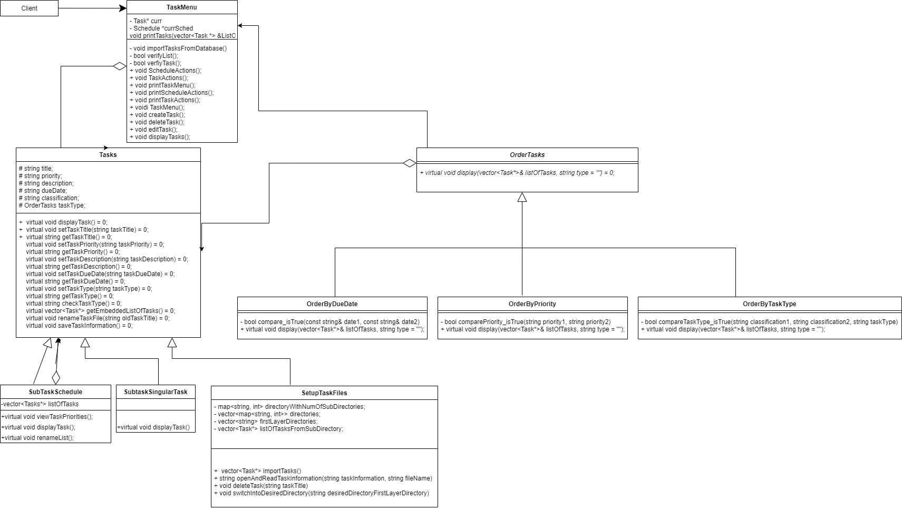

# Task Scheduler
 > Authors: [Sumit Gupta](https://github.com/sumitgupta314), [Jordan Sam](https://github.com/Jsam88), [Benson Wan](https://github.com/iarebwan)

## Project Description
 > * Why is it important or interesting to you?
 >   * This project is important to us because we believe it would be fun and useful to create a program that will benefit people in their everyday lives. It also has the potential to be used by a large population of people who would like to create a schedule to keep themselves more organized. Before someone makes the mistake of double booking themselves and failing to properly manage their time, they will now have the chance to prevent that. Not only will it help us as people to become more organized, but we will also utilize new strategies and skills learned from this CS100 course.
 >   
 > * What languages/tools/technologies do you plan to use?
 >   * [C++](https://www.cplusplus.com/) - Using this middle level language, we will create a console interface in which the client has the ability to input commands from the keyboard to utilize the system while also displaying the inputs on screen.
 >   * [CMake](https://cmake.org/) - We will use CMake for build automation and compiling our program.
 >   * [Git](https://git-scm.com/) - We will use Git as the version control tool to coordinate work, keep track of changes in our code, and keep our project up to date. 
 >   * [Valgrind](https://valgrind.org/) - We will use the Valgrind framework to construct dyanmic analysis tools to help us with memory debugging and detecting memory leaks.
 >   
 > * What will be the input/output of your project?
 >   * The inputs of our project would be times, dates, and the task descriptions. We are planning on using the twelve hour clock time period for the time input as well as the options for days, weeks, and months for the date input, and the task description will just be anything the user enters to describe the certain task being scheduled. 
 >   * The outputs would be the actual scheduled task displayed for the user to view and also approvals/denials for the task to be scheduled depending on whether the inputs are valid. 
 >   
 > * What are the two design patterns you will be using?
 >   * The two design patterns that we plan to use are the Composite and Strategy pattern.
 >   * We are going to use the composite pattern because it would be easier to add new components if we want to implement and improve our original system. Given that this design pattern is very flexible, we will be able to create both primitive and complex objects for our classes (class hierarchies) in an ideal, organized way. In this case, we would make task lists composite and the feature that we want to implement with it is the ability to store subtasks within another task list. This means the leaf/primitive would be a singular task within our lists. A problem that we anticipate encountering while working on our project that the composite pattern will solve is disorganization. We can create a class of folders that essentially allows us to hold task lists within task lists and organize all of the created schedules that we create.
 >   * We will also be using the strategy design pattern to let the program determine at runtime which class (strategy) to use. This way, based on user choices it can be determined during runtime which class needs to be used to order and print the tasks the way the user wants. The feature we will implement with this design pattern is printing out the user’s tasks in different orders. The order can be chosen by the user depending on if they choose to see their tasks ordered by due date, priority (high, medium, low), or type of task (personal, work, study). The problem we may face is having too much code for displaying the user’s tasks in different orders, and the strategy pattern can help with simplifying the code.

## Class Diagram
 > 
 > Class Diagram Description:
 > * The Composite design pattern in our project are the 3 classes of Tasks (Component class), TaskFolder (Composite class), and LeafTask (leaf class). For this project, the Tasks class is essentially the abstract base class that sets the default behavior for both the TaskFolder and LeafTask classes. With the TaskFolder class, we are able to create a hierarchy of sub-tasks and create a folder which holds all of the other user schedules if they have more than one type of schedule or if the user wants to create a folder for a specific category of tasks. Finally, the LeafTask covers a task that does not have other tasks embedded in it. The TaskFolder class has an aggregation relationship with the Tasks class because it has a vector of Tasks objects. The Tasks class has an aggregation relationship with the OrderTasks class so that it can specify how to order tasks and call the display function to print the tasks in that order. By utilizing the composite pattern, the client will have an easier time interacting with an interface that has both complex and primitive objects.
 > * The Strategy design pattern is on the right side of the diagram. For this pattern, we have the abstract class as OrderTasks (Compositor) that has a virtual function called display(string type). The OrderTasks abstract class has three derived classes (Strategy classes) where each derived class displays the tasks in a different order. The OrderByDueDate class has a display function that displays the tasks in the order of the closest due date on the top and the farthest due date on the bottom. Similarly, the OrderByPriority class displays the tasks with high priority tasks being displayed on top, medium priority tasks displayed in the middle, and low priority tasks displayed on the bottom. The OrderByTaskType class displays the tasks by the task type (personal, work, or study) the user chooses to be displayed on top.

 ## Screenshots
 > * This first image is a picture of the main menu that will be prompted to the user on startup.
 > 
 > 
 > * This second image is an example of how displaying user tasks will look like. The indentations signify subtasks within larger tasks.
 > 
 > 
 > * This third image shows what the user will be prompted with when creating a task and/or schedule. The user input is then saved into directories and text files within the database.
 > 
 > 
 > * This fourth image shows an example of how displaying tasks by certain sorting order looks like. The user will have the option to sort tasks by priority, due date, and personal classification.
 > 
 > 
 ## Installation/Usage
 > Instructions on installing and running our application:
 > * In order to use our program, you would first clone our project repository (git clone https://github.com/cs100/final-project-bwan008_jsam007_sgupt060.git) into your local machine and change into its directory.
 > * Next you would compile the application by running the command "g++ -std=c++17 main.cpp -o main" in your terminal followed by "./main.exe" to execute it.
 > * It is highly recommended that you utilize the notepad formated as TASK TITLE: userInput\n\n, TASK PRIORITY: userInput\n\n, TASK DESCRIPTION userInput\n\n, TASK DUE DATE: userInput\n\n, TASK CLASSIFICATION: userInput\n\n (The program will only function properyly if the text files are formatted this way so this is highly encouraged).
 > * NOTES: 
 >   * Due date has to be formatted as mm/dd/year, Priority as the words "low, medium, and high", and Classification as "personal, work, and academic". 
 >   * Makes sure that Priority and Classification are inputted with the entire word in lower case with no extra space or character at the end. (Images of the program above may show the Priorities and Classifications being inputted and displayed with an uppercase, but after debugging and improving our code, the program only works properly with lower case inputs now. Everything else in the images are the same though.)
 >   * \n is newline or "Enter" on your keyboard.
 >   * When creating a schedule manually (a folder), make sure to create a text file within that folder with the same name as the folder, as the program requires that text file to run correctly. 
 ## Testing
 > * We tested our project utilizing gtest for c++. We created a task folder that holds all of the seperate unit tests for each class and tested expected user inputs and invalid user inputs. The have a seperate branch to test the strategy pattern and we made mock test files to make sure that we implemented the functions correctly. We also tested mock main.cpp cases manually where we call the menu in a main.cpp, tests its actions and its functionality, and finally carry out those functions that implement both the composite pattern and strategy pattern.

